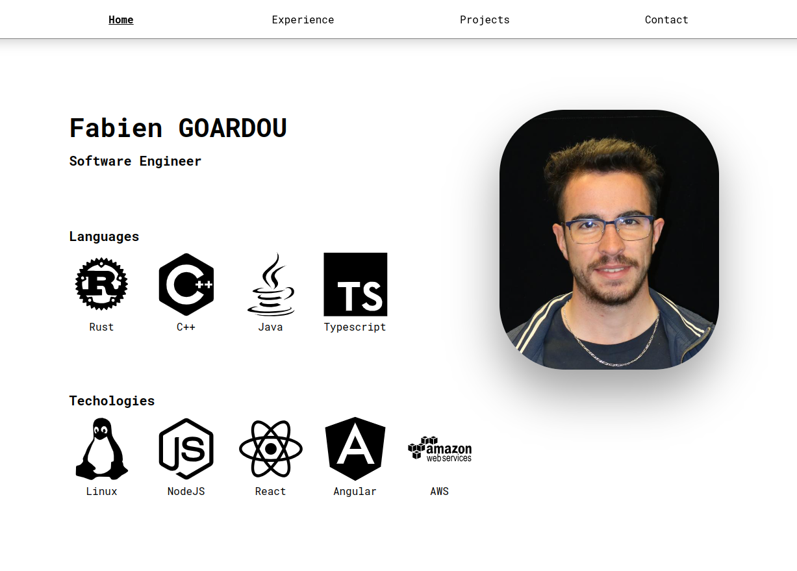

# Fgdou's portfolio

https://fabiengoardou.fr/



A website representing my resume built in rust with the [Yew](https://yew.rs/) framework.

# Run it yourself
Simply run :
```shell
docker run -p 80:80 ghcr.io/fgdou/portfolio:master
```
# Build
## Dev
```shell
docker compose -f compose.dev.yml up -d
```
## Prod
```shell
docker compose -f compose.prod.yml up -d
```